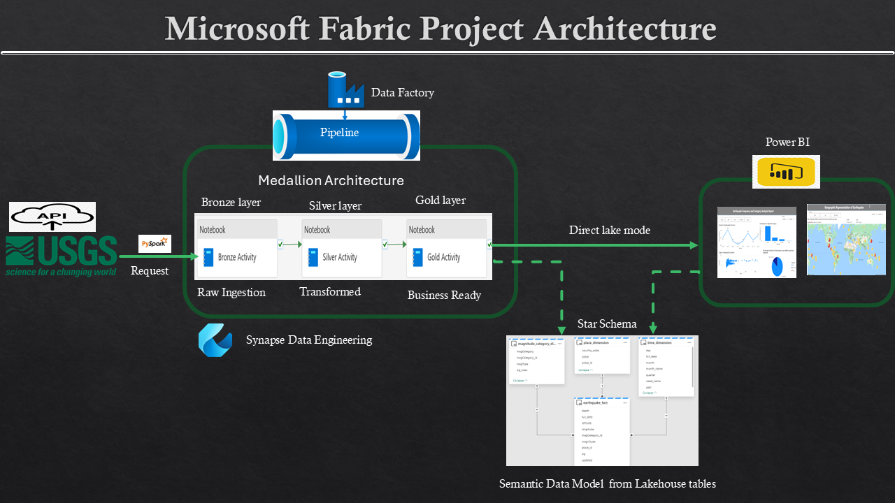
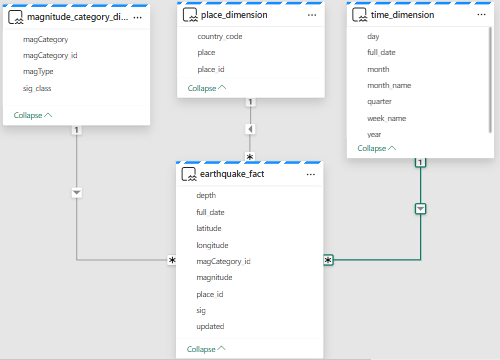
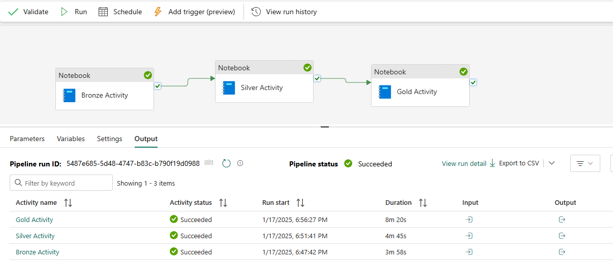
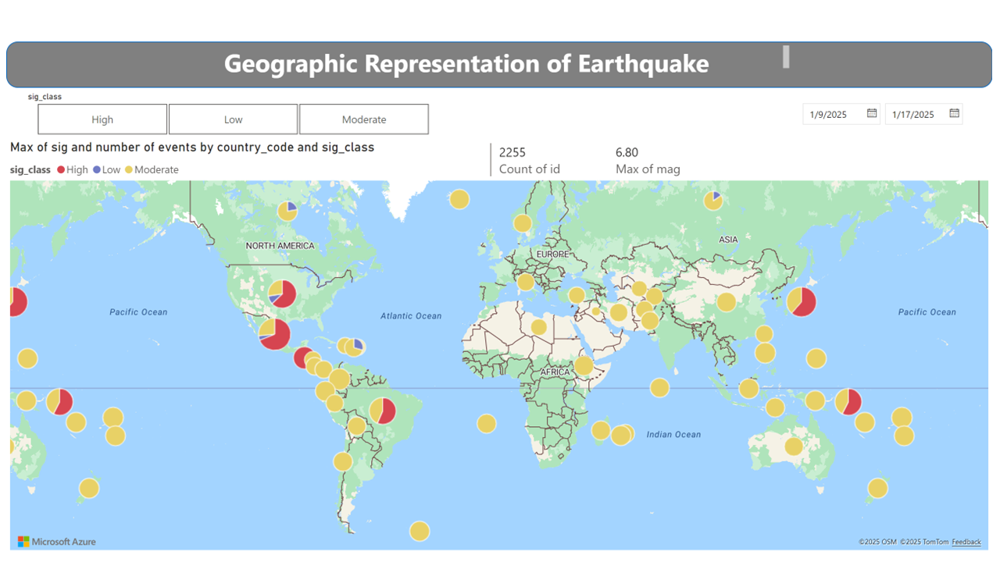

# Earthquake Data Engineering Pipeline with Microsoft Fabric

## Overview

This repository contains the implementation of a comprehensive data engineering pipeline for earthquake data using Microsoft Fabric. The pipeline processes earthquake data from the USGS API and employs the Medallion architecture to organize data into three layers: Bronze, Silver, and Gold.

## Project Architecture
The project utilizes a star schema model for the gold layer, ensuring optimized query performance and easy integration with Power BI.

The project utilizes the Medallion architecture, with data flowing from raw ingestion to business-ready insights. The architecture includes the following layers:

Bronze Layer: Raw data storage

Silver Layer: Data cleaning and transformation

Gold Layer: Business-ready data for visualization

## Project Structure

- **Bronze Layer**: Raw data ingestion from the USGS API. [usgs](https://earthquake.usgs.gov/)

Description: Stores raw earthquake data as ingested from the USGS API.

Data: Captures properties such as magnitude, location, and time of the earthquakes.

- **Silver Layer**: Cleaned and enriched data.

Description: Cleans and transforms the raw data, adding contextual information such as geolocation details.

Data Transformations:

Converting epoch time to human-readable format

Categorizing magnitude into bins

- **Gold Layer**: business-ready data for visualization.

Description: Business-ready data stored in a star schema for analysis.

Schema:

Fact Table: Earthquake_Fact containing earthquake event details.

Dimension Tables:

Place_Dimension (Primary Key: place_id)

Magnitude_Category_Dimension (Primary Key: magCategory_id)

Time_Dimension (Primary Key: full_date)

   

Refer for detail table Structures	   
[Documentation](docs/Document_Microsoft_Fabric.pdf)    

## Key Features

Data Orchestration: Microsoft Fabric’s Data Factory manages the data pipeline, automating data ingestion and transformation.

Data Processing: PySpark handles data transformations, applying business logic and enriching datasets.

Visualization: Power BI provides interactive reports and visualizations, such as earthquake frequency and impact analysis.

## Pipeline Steps

Bronze Layer: Raw data ingestion.     
[Ingestion:Bronze Layer notebook](notebooks/Bronze_Notebook.ipynb)    

Silver Layer: Data transformation and enrichment.     
[Transformation:Sliver Layer notebook](notebooks/Silver_Notebook.ipynb)      

Gold Layer: Business-ready data stored in a star schema ready for analysis.  
[Business-ready :Gold_layer-Build_Initial_tables notebook](notebooks/Gold_layer-Build_Initial_tables.ipynb)   
[Business-ready :Gold_layer daily update of tables](notebooks/Gold_Notebook.ipynb)  

## Power BI Reports
Visualizations
Earthquake Frequency: Frequency of earthquakes visualized by location and magnitude.
Geospatial Analysis: Interactive maps showing earthquake locations and affected areas.    
[Power BI reportS](visualization/Worldwide_events.pptx)	  

## Requirements

Environment: Microsoft Fabric

Tools: PySpark, Power BI

Data Source: USGS Earthquake API [usgs](https://earthquake.usgs.gov/)

## Conclusion

This project highlights the use of Microsoft Fabric for building an efficient, scalable data engineering pipeline that transforms raw data into actionable insights through structured data processing and visualization.
